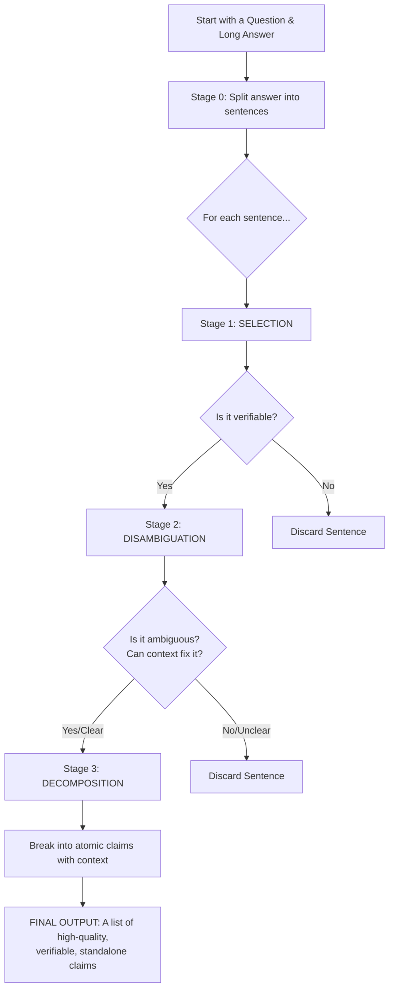

## **Claimify for Dummies: A Developer's Guide to Extracting High-Quality Factual Claims**

### The Big Idea

Imagine you have a long text from an LLM, like an answer to a complex question. You want to fact-check it. Doing it all at once is hard. A common strategy is to **"Decompose-then-Verify"**:

1.  **Decompose:** Break the long text into small, simple, factual statements (we'll call these **claims**).
2.  **Verify:** Fact-check each tiny claim one by one.

The problem? **Garbage in, garbage out.** If your claims are bad (misleading, incomplete, or taken out of context), your entire fact-checking process will fail.

**Claimify** is a sophisticated pipeline designed to solve this problem by extracting *excellent* claims. This guide will show you how to implement the core logic.

### The Three Pillars of a Great Claim

Before we build, let's define what makes a claim "excellent". Your goal is to generate claims that have three key properties:

**1. Entailment (The "Is it Supported?" Test)**

*   **Simple Definition:** If the original source sentence is true, the extracted claim *must also be true*. The claim cannot add information or make inferences that aren't explicitly supported.
*   **Example:**
    *   **Source Sentence:** *"In the latest episode of Jane Doe's podcast on electric vehicles, John Smith supports government regulations."*
    *   **GOOD Claim (Entailed):** *"John Smith supports government regulations in the context of a discussion on electric vehicles."*
    *   **BAD Claim (Not Entailed):** *"John Smith supports all government regulations."* (This is an unsupported generalization).

**2. Coverage (The "Did you get all the facts and *only* the facts?" Test)**

*   **Simple Definition:** Your claims should capture all the verifiable, factual information from a sentence, while ignoring all the unverifiable fluff, opinions, or subjective language.
*   **Example:**
    *   **Source Sentence:** *"The iconic American flag has 50 stars and 13 stripes."*
    *   **GOOD Claims (Good Coverage):**
        1.  *"The American flag has 50 stars."*
        2.  *"The American flag has 13 stripes."*
    *   **BAD Claims (Bad Coverage):**
        *   *"The American flag is iconic."* (Includes unverifiable fluff).
        *   *"The American flag has numerous stars and stripes."* (Omits specific, verifiable numbers).

**3. Decontextualization (The "Does it Stand Alone?" Test)**

*   **Simple Definition:** Can a fact-checker understand and verify the claim without needing to read the original source text? The claim must contain all the necessary context to preserve its original meaning.
*   **The Litmus Test:** Missing context is only a problem if including it would **change the fact-checking verdict** (from true to false, or vice-versa).
*   **Example:**
    *   **Source Context:** The text is about John Smith's appearance on a podcast about *electric vehicles*.
    *   **Source Sentence:** *"John Smith supports government regulations."*
    *   **BAD Claim (Poorly Decontextualized):** *"John Smith supports government regulations."*
        *   *Why it's bad:* A fact-checker might search and find an article where John Smith *opposes* healthcare regulations, and incorrectly label the claim "False".
    *   **GOOD Claim (Well Decontextualized):** *"During a podcast episode on electric vehicles, John Smith expressed support for government regulations."*
        *   *Why it's good:* This claim is self-contained. The verdict won't change based on external, irrelevant information.

---

## The Claimify Pipeline: A Step-by-Step Guide

Here’s how to build a simplified Claimify process. Each stage is a call to an LLM with a specific prompt.

### **Stage 0: Prep Work (Input & Sentence Splitting)**

*   **What it is:** Get your input text (e.g., a question and a long answer) and chop the answer into a clean list of sentences.
*   **How to Implement it (The "Dummies" Way):**
    1.  Take the full answer text.
    2.  Split it into paragraphs (e.g., splitting on `\n\n`). This helps handle bullet points.
    3.  For each paragraph, use a standard library like NLTK (`nltk.sent_tokenize`) to split it into sentences.
    4.  You now have a list of sentences to process one by one.

### **Stage 1: Selection (Filtering for Verifiable Content)**

*   **What it is:** For each sentence, decide: "Does this contain a verifiable fact, or is it just opinion, a recommendation, or generic fluff?" If it's a mix, we only keep the factual part. This stage ensures good **Coverage**.
*   **How to Implement it:**
    *   For each sentence, give an LLM a prompt like this:

> **PROMPT: SELECTION**
>
> You are a fact-checking assistant. Your job is to identify if the following sentence contains a specific, verifiable proposition. A verifiable proposition is a statement of fact, not an opinion, a recommendation, or a vague statement.
>
> **Source Sentence:** "{sentence}"
>
> **Task:**
> 1.  **Analyze:** Does the sentence contain a verifiable fact?
> 2.  **Decide:**
>     *   If NO, respond with "NO_VERIFIABLE_CONTENT".
>     *   If YES, rewrite the sentence to *only* include the verifiable parts. Remove any subjective or speculative language.
>
> **Your rewritten sentence or "NO_VERIFIABLE_CONTENT":**

*   **Example Flow:**
    *   **Input Sentence:** *"However, some of these organisms are also threatened by human activities, such as logging, mining, grazing and climate change, and may not survive much longer without conservation efforts."*
    *   **LLM Output:** *"Some of these organisms are threatened by human activities, such as logging, mining, grazing, and climate change."* (The speculative part is removed).
*   **Action:** If the LLM returns "NO_VERIFIABLE_CONTENT", discard the sentence. Otherwise, pass the cleaned-up sentence to the next stage.

### **Stage 2: Disambiguation (Resolving Ambiguity)**

*   **What it is:** Look at the cleaned-up sentence. Could it mean multiple things? (e.g., "they", "it", "next year"). Can we use the surrounding text (the context) to figure out the one true meaning? If we can't be sure, we throw it away. It's better to have fewer, high-quality claims than to guess. This stage improves **Decontextualization**.
*   **How to Implement it:**
    *   For each surviving sentence, use a prompt like this. Provide a few sentences of context.

> **PROMPT: DISAMBIGUATION**
>
> You are a fact-checking assistant. Your goal is to resolve ambiguity.
>
> **Context (surrounding text):** "{context_sentences}"
> **Sentence to Analyze:** "{sentence_from_stage_1}"
>
> **Task:**
> 1.  **Identify Ambiguity:** Does the sentence contain any pronouns (he, it, they), ambiguous time references (last year), or structural ambiguities (where grammar allows multiple readings)?
> 2.  **Resolve with Context:** Can the context clearly and confidently resolve all ambiguities?
> 3.  **Decide:**
>     *   If the ambiguity CANNOT be confidently resolved, respond with "CANNOT_DISAMBIGUATE".
>     *   If it CAN be resolved (or if there was no ambiguity), return the fully clarified and rewritten sentence.
>
> **Your rewritten sentence or "CANNOT_DISAMBIGUATE":**

*   **Action:** If the LLM returns "CANNOT_DISAMBIGUATE", discard the sentence. Otherwise, pass the final, unambiguous sentence to the last stage.

### **Stage 3: Decomposition (Creating the Final Claims)**

*   **What it is:** Take the clean, unambiguous sentence and break it into one or more simple, standalone factual claims. This is the final step for achieving perfect **Decontextualization** and **Coverage**, and the output must maintain **Entailment**.
*   **How to Implement it:**
    *   For each final, polished sentence, use a prompt like this:

> **PROMPT: DECOMPOSITION**
>
> You are an expert fact-checker. Your task is to decompose the given sentence into a list of simple, atomic, and fully decontextualized factual claims.
>
> **Rules:**
> 1.  Each claim must be a complete, self-contained sentence.
> 2.  Break the sentence into the smallest possible pieces of verifiable information.
> 3.  If a claim needs context to be understood, add the clarifying information inside [square brackets].
>
> **Sentence to Decompose:** "{sentence_from_stage_2}"
>
> **List of Decomposed Claims (one per line):**

*   **Example Flow:**
    *   **Input Sentence:** *"During a podcast episode on electric vehicles, John Smith, a celebrity, expressed support for government regulations in the Middle East."*
    *   **LLM Output (Final Claims):**
        *   `John Smith [a celebrity] expressed support for government regulations.`
        *   `The support for government regulations was expressed during a podcast episode.`
        *   `The podcast episode was about electric vehicles.`
        *   `John Smith [a celebrity] expressed support for government regulations [in the Middle East].`

---

## Putting It All Together: The Flowchart

