# ⚙️ ClarifAI Configuration Panel Design

## 🎯 Purpose

This panel allows the user to configure key system behaviors and agent parameters. It serves as an interface for tuning the AI's sensitivity, selecting models, enabling/disabling features, and controlling job scheduling.

ClarifAI may expose this configuration via:

* a YAML file (`./settings/clarifai.config.yaml`)
* a lightweight UI panel
* both, with UI always reflecting current YAML state

---

## 🧩 Configuration Sections

```mermaid
graph TB
  A[🤖 Model & Embedding Settings]
  B[📏 Thresholds & Parameters]
  C[🧠 Agent Toggles]
  D[🧠 Highlight & Summary Jobs]
  E[🕒 Automation & Scheduler Control]
  F[📁 Vault Paths and Type Detection]

  A --> B --> C --> D --> E --> F
```



---

### 1. 🤖 Model & Embedding Settings

ClarifAI lets users specify LLMs and embedding models per agent. This section defines all model roles and content-type-specific embeddings in use.

---

#### 🔮 Inference Models

| Setting                         | Description                                              | Example               |
| ------------------------------- | -------------------------------------------------------- | --------------------- |
| `model.claimify.default`        | Default for all Claimify steps                           | `gpt-4`               |
| `model.claimify.selection`      | Model for Claimify selection stage                       | `claude-3-opus`       |
| `model.claimify.disambiguation` | Model for Claimify disambiguation                        | `mistral-7b`          |
| `model.claimify.decomposition`  | Model for Claimify decomposition                         | `gpt-4`               |
| `model.concept_linker`          | Used to classify Claim→Concept relationships             | `mistral-7b`          |
| `model.concept_summary`         | Generates individual `[[Concept]]` Markdown pages        | `gpt-4`               |
| `model.subject_summary`         | Generates `[[Subject:XYZ]]` pages from concept clusters  | `mistral-7b`          |
| `model.trending_concepts_agent` | Writes newsletter-style blurbs for Top/Trending Concepts | `gpt-4`               |
| `model.fallback_plugin`         | Used when format detection fails                         | `openrouter:gemma-2b` |

---

#### 🧬 Embedding Models

| Setting               | Description                            | Example                  |
| --------------------- | -------------------------------------- | ------------------------ |
| `embedding.utterance` | Embeddings for Tier 1 utterance blocks | `all-MiniLM-L6-v2`       |
| `embedding.concept`   | Embeddings for Tier 3 concept files    | `text-embedding-3-small` |
| `embedding.summary`   | Embeddings for Tier 2 summaries        | `bge-small-en-v1.5`      |
| `embedding.fallback`  | Used if other embedding configs fail   | `mpnet-base-v2`          |

---

#### ✅ Example YAML Block

```yaml
model:
  claimify:
    default: gpt-4
    selection: claude-3-opus
    disambiguation: mistral-7b
    decomposition: gpt-4
  concept_linker: mistral-7b
  concept_summary: gpt-4
  subject_summary: mistral-7b
  trending_concepts_agent: gpt-4
  fallback_plugin: openrouter:gemma-2b

embedding:
  utterance: all-MiniLM-L6-v2
  concept: text-embedding-3-small
  summary: bge-small-en-v1.5
  fallback: mpnet-base-v2
```

---

### 2. 📏 Thresholds & Parameters

| Setting                         | Description                                         | Example |
| ------------------------------- | --------------------------------------------------- | ------- |
| `threshold.concept_merge`       | Cosine similarity threshold for merging candidates  | `0.90`  |
| `threshold.claim_link_strength` | Minimum link strength to create graph edge          | `0.60`  |
| `window.claimify.p`             | Number of previous sentences to include in context  | `3`     |
| `window.claimify.f`             | Number of following sentences to include in context | `1`     |

---

### 3. 🧠 Agent Toggles

Users can disable specific ClarifAI agents to speed up processing or isolate behavior.

```yaml
agents:
  claimify: true
  concept_linker: true
  fallback_plugin: true
  graph_writer: true
```

---

### 4. 🧠 Concept Highlight & Summary Jobs

ClarifAI periodically generates global summary pages that reflect the evolving structure of your knowledge graph. These are scheduled jobs that produce Markdown content using internal signals and LLM-based writing agents.

---

#### 🗂️ Top Concepts & Trending Topics

These jobs generate vault-wide overview documents. Each one includes a bulleted list of concepts with short blurbs, written by a dedicated LLM agent.

```yaml
concept_highlights:
  top_concepts:
    metric: pagerank              # pagerank | degree
    count: 25                     # number of top concepts (exclusive with percent)
    percent: null                 # use top N% instead of fixed count
    target_file: Top Concepts.md

  trending_topics:
    window_days: 7                # How far back to look for change
    count: null
    percent: 5
    min_mentions: 2
    target_file: Trending Topics - {date}.md
```

The writing is handled by a configured agent that converts ranked concepts into a newsletter-style Markdown file.

```yaml
model:
  trending_concepts_agent: gpt-4
```

---

#### 🧠 Concept Summary Agent

This agent generates a `[[Concept]]` Markdown page for each canonical `(:Concept)` in the graph. It is purely local — no external web access.

```yaml
concept_summaries:
  model: gpt-4
  max_examples: 5
  skip_if_no_claims: true
  include_see_also: true
```

---

#### 🧠 Subject Summary Agent

The subject summary agent explores clusters of semantically or topologically related concepts. For each group, it generates a `[[Subject:XYZ]]` page that either:

* Presents a well-known subject (e.g. “GPU Errors”) by elaborating on known relationships
* Or explores a novel intersection where connected concepts suggest a merging theme

This agent may access web data to enhance explanation and relevance but focuses primarily on signals from the graph and vault.

```yaml
subject_summaries:
  model: mistral-7b
  similarity_threshold: 0.92
  min_concepts: 3
  max_concepts: 15
  allow_web_search: true
  skip_if_incoherent: false
```

---

### 5. 🕒 Automation & Scheduler Control

**Pause system-wide automation:**

```yaml
automation.pause: false
```

**Override scheduler behavior per job:**

```yaml
scheduler:
  concept_embedding_refresh:
    enabled: true
    cron: "0 3 * * *"
  sentence_splitter:
    enabled: false
```

---

#### 📋 Example Configuration Block (YAML)

```yaml
model:
  claimify: gpt-4
  fallback_plugin: ollama:gemma:2b
threshold:
  concept_merge: 0.91
  claim_link_strength: 0.60
window:
  claimify:
    p: 3
    f: 1
agents:
  concept_linker: true
  fallback_plugin: true
automation:
  pause: false
scheduler:
  concept_embedding_refresh:
    enabled: true
    cron: "0 3 * * *"
```

---

### 6. 📁 Vault Paths and Document Type Detection

ClarifAI lets you configure where to store different tiers of content. Folder paths are **optional**, and document types are **inferred from metadata**, so you can flatten or restructure your vault freely.

```yaml
paths:
  tier1: "tier1"
  summaries: "."
  concepts: "."
  logs: ".clarifai/import_logs"
```

| Key         | Description                                  | Default                 |
| ----------- | -------------------------------------------- | ----------------------- |
| `tier1`     | Folder to write Tier 1 conversation Markdown | `tier1`                 |
| `summaries` | Folder to write Tier 2 summaries             | Vault root (`"."`)      |
| `concepts`  | Folder to write Tier 3 concept pages         | Vault root (`"."`)      |
| `logs`      | Diagnostic and import logs                   | `.clarifai/import_logs` |

## 🔍 How ClarifAI Detects Document Types

ClarifAI identifies files by their **content**, not their location:

| Document Type | Detected By                                                                 |
| ------------- | --------------------------------------------------------------------------- |
| Tier 1        | Presence of `clarifai:id=blk_*` and `^blk_*`                                |
| Tier 2        | Presence of `clarifai:id=clm_*`, with summaries referencing Tier 1 blocks   |
| Tier 3        | Presence of `clarifai:id=concept_*` and a `# Concept:` header or definition |
| Optional      | `<!-- clarifai:type=tier2 -->` comment overrides automatic detection        |

This hybrid approach allows:

* Traditional folder separation (default)
* Fully flattened vaults for Obsidian minimalists
* Mixed structures across team workflows

ClarifAI will always create missing folders when writing files, but never requires a fixed layout.

---

## 🧪 UI Behavior Notes

* Any change in the UI should write back to the YAML config file immediately (or on save)
* Invalid configs (e.g., non-numeric thresholds) must be rejected by the UI inline
* Pausing automation should be reflected in both:

  * this panel (`automation.pause`)
  * the Review Panel (“Automation Paused” banner or status indicator)
