# 📥aclarai Import Panel Design

## 🎯 Purpose

The import panel is the first interaction point. It allows users to select and ingest conversations from various formats, initiate processing, and see real-time feedback on success, fallback plugin usage, or rejection.

---

## 🖼️ Layout Overview


Each component is visually separate and stackable vertically in a minimal UI.

---

## 🧩 Components

### 1. **File Picker**

**Behavior:**

* Supports drag-and-drop and native file picker
* Accepts `.json`, `.md`, `.txt`, `.csv`, `.zip`
* May batch process multiple files

**UI Element:**

```plaintext
+----------------------------------------+
|  📁  Drag files here or click to browse |
+----------------------------------------+
```

---

### 2. **Format Detection**

**Behavior:**

* Applies all pluggable format detectors (`can_accept()`)
* If no format matches, routes to the fallback plugin
* Never prompts user to select a format manually

**Metadata captured:**

* Original filename
* Detector used (e.g., `chatgpt_json`, `fallback_llm`)
* aclarai import ID
* Outcome (success, skipped, failed)

---

### 3. **Live Import Queue**

```mermaid
flowchart TD
  A[Incoming file] --> B{Valid format?}
  B -- Yes --> C[Import → Tier 1 Markdown]
  B -- No --> D[Fallback Plugin → Tier 1 Markdown]
  C --> E[Show ✓ success]
  D --> E
  B -- Corrupt --> F[Show ✖ error]
```



**UI Display:**

| Filename           | Status      | Detector       | Action        |
| ------------------ | ----------- | -------------- | ------------- |
| `log1.json`        | ✅ Imported  | `chatgpt_json` | View Summary  |
| `badfile.txt`      | ❌ Failed    | None           | Error Details |
| `slack_thread.csv` | ⚠️ Fallback | `fallback_llm` | View Output   |

---

### 4. **Post-import Summary**

Appears after all files are processed:

* Count of:

  * Files imported
  * Files skipped (e.g., duplicates)
  * Files that failed
* Link to view affected entries in the vault (e.g. `vault/tier1/`)

**Example:**

```plaintext
✅ Imported 12 files
⚠️ 3 used fallback plugin
❌ 1 file failed to import

[View Imported Files] [Download Import Log]
```

---

## ⚠️ Edge Cases

| Case                          | Behavior                               |
| ----------------------------- | -------------------------------------- |
| Duplicate file (already seen) | Skip with message: “Duplicate skipped” |
| Corrupt or empty              | Mark as failed, disable retry          |
| Password-protected archives   | Skip with message: “Encrypted archive” |

---

## 🔧 Developer Notes

* Import queue should be driven by an event stream (not polling)
* Logs should be stashed in a subfolder like `.aclarai/import_logs/`
* This panel should remain usable even if automation is paused
