# 📊 ClarifAI Review & Automation Status Panel Design

## 🎯 Purpose

This panel provides a central place to review what ClarifAI has done — or is scheduled to do — across all tiers. It shows claim metadata, automation state, file-level job status, and lets the user pause/resume processing.

It does **not** replace Obsidian’s Markdown views — it overlays structure and status without interfering with editing workflows.

---

## 🖼️ Layout Overview

```mermaid
graph TD
    A[📁 File / Block Index] --> B[🔎 Claim Detail View]
    D[🧭 Claim Explorer] --> B
    C[⚙️ Automation Status + Controls]
```



This is a panel-based layout: select a file/block → inspect claim metadata → see or control automation status.

---

## 🧩 Components

### 1. **📁 File / Block Index**

Shows recent files, extracted blocks, and processing state.

#### 🔁 View Toggle

At the top of the interface:

```

[ 📁 File View ] [ 🔍 Claim Explorer ]

````

The default view shows the file/block index. Clicking **Claim Explorer** activates is (section 4).

#### Contents

| File / Block ID         | Type   | Status     | Last Run    |
| ----------------------- | ------ | ---------- | ----------- |
| `log123.json`           | Tier 1 | ✅ Complete | 5 min ago   |
| `conv-alpha-summary.md` | Tier 2 | ⏳ Queued   | —           |
| `CUDA error.md`         | Tier 3 | ✅ Embedded | 2 hours ago |

User can click any row to inspect its content or metadata.

---

### 2. **🔎 Claim Detail View**

When a block is selected, show:

* The original Markdown block
* Metadata:

  * `entailed_score`, `coverage_score`, `decontextualization_score`
  * `clarifai:id` and `ver=`
  * Linked concepts
* Link status:

  * `SUPPORTS_CONCEPT → [[Concept]]`
  * Graph edge exists: ✅ / ❌

**Actions (if allowed):**

* \[Trigger reprocessing]
* \[Unlink concept]
* \[View in Obsidian]

---

### 3. **⚙️ Automation Status + Controls**

Shows whether ClarifAI is running in live mode, paused, or selectively disabled.

| Setting         | State     | Source       |
| --------------- | --------- | ------------ |
| Automation      | ✅ Running | config.yaml  |
| Claimify        | ✅ Enabled | agent toggle |
| Concept refresh | ❌ Skipped | paused flag  |

---

#### Pause Button

```plaintext
[ ⏸️ Pause Automation ]
```

* Sets `.clarifai_pause` flag in vault root
* Disables all job scheduling except manual actions
* Button toggles to:

```plaintext
[ ▶️ Resume Automation ]
```

---

#### Job Log Preview

Each scheduled job shows last run time and next scheduled run:

| Job                       | Last Run  | Next Run     | Status   |
| ------------------------- | --------- | ------------ | -------- |
| Vault Sync                | 2 min ago | 58 min       | ✅ OK     |
| Concept Embedding Refresh | Yesterday | Tonight 3 AM | ✅ OK     |
| Claim Linking             | —         | —            | ❌ Paused |

---

## 🔧 Developer Notes

* Pulls state from `.clarifai_pause`, `clarifai.config.yaml`, and runtime job registry
* Should support job-specific pause overrides (e.g., `scheduler.claim_linking.enabled: false`)
* Displays Vault-relative paths for links to Markdown blocks

You're absolutely right — thanks for calling that out.

Given the actual structure of `design_review_panel.md` (as provided), here's the properly integrated update, including:

* ✅ An updated **mermaid diagram**
* ✅ Correct insertion as **section 4**
* ✅ Sequential and structural consistency

---

### 🔁 Updated `design_review_panel.md` Patch

Replace the **existing diagram** at the top with:

```mermaid
graph TD
    A[1. 📁 File / Block Index] --> B[2. 🔎 Claim Detail View]
    D[4. 🧭 Claim Explorer] --> B
    C[3. ⚙️ Automation Status + Controls]
```



---

### 4. 🧭 Claim Explorer

This mode offers a searchable, cross-file view of all extracted claims — useful for identifying failed evaluations, low-quality scores, or topics of interest.

#### 🔁 View Toggle

At the top of the interface:

```

[ 📁 File View ] [ 🔍 Claim Explorer ]

````

The default view shows the file/block index (Section 1). Clicking **Claim Explorer** activates the global view.

#### 🔍 Search Field

A simple text box lets users filter the claim list by:

- Text content (e.g., "GPT-4")
- Score values (e.g., "null", "0.67")
- Planned keywords:  
  - `failed`: show claims with any null score  
  - `low`: show claims with low geomean  
  - `concept:<term>` (future)

Example:

```plaintext
[ 🔍 filter claims... _______ ] 
````

#### 📋 Results View

Filtered claims appear as a scrollable list, each line showing:

```plaintext
"OpenAI released GPT-4 in 2023."
  entailed: 0.92 | coverage: 0.84 | decontextualized: 0.87

"It increased rapidly."
  entailed: null | coverage: 0.67 | decontextualized: 0.42
```

Clicking any row navigates to its full detail view (same as selecting a block).
