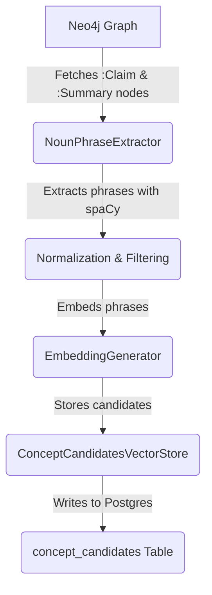

# Noun Phrase Extraction System

This document provides a high-level overview of the Noun Phrase Extraction system, a core component of ClarifAI's concept detection pipeline.

## Overview

The Noun Phrase Extraction system is responsible for identifying and processing potential concepts from existing `(:Claim)` and `(:Summary)` nodes within the Neo4j knowledge graph. Its primary goal is to populate the `concept_candidates` vector table, which serves as the input for the concept deduplication and promotion workflow.

## Architecture

The system is composed of three main components, all located in the `shared/clarifai_shared/noun_phrase_extraction/` module:

-   **`NounPhraseExtractor`**: The main orchestrator that fetches graph nodes, uses spaCy for extraction, normalizes the text, and coordinates storage.
-   **`ConceptCandidatesVectorStore`**: A specialized vector store that manages the `concept_candidates` table in PostgreSQL. It handles embedding generation and provides methods for storing and querying candidates.
-   **Data Models**: Includes `NounPhraseCandidate` and `ExtractionResult` to ensure type-safe data handling throughout the pipeline.

### Data Flow

## Key Features

### Dynamic Embedding Dimensions

This system dynamically determines the correct embedding dimension from the configured model rather than relying on static configuration. This ensures compatibility when users change embedding models and prevents dimension mismatch errors.

### Batch Processing

The system implements efficient batch processing for both embedding generation and vector storage operations, significantly reducing database round-trips and improving performance for large-scale extractions.

### Resilient Error Handling

The extraction process gracefully handles individual node failures without stopping the entire batch, ensuring maximum data recovery even when some source nodes have malformed content.

## Role in the ClarifAI Ecosystem

This system acts as a bridge between raw, extracted claims/summaries and the canonical concept layer. By creating a pool of "concept candidates," it enables the next stage of the pipeline (concept detection via `hnswlib`) to identify and merge semantically similar ideas before they are promoted to full `(:Concept)` nodes in the graph.

The extracted noun phrases serve as the foundation for:

1. **Concept Deduplication**: Identifying semantically similar phrases across different source documents
2. **Concept Promotion**: Converting high-quality candidates into canonical concepts
3. **Semantic Search**: Enabling users to find related content through conceptual similarity
4. **Knowledge Graph Enhancement**: Enriching the graph with structured concept relationships

## Configuration Integration

The system follows ClarifAI's configuration-driven architecture, reading all parameters from `settings/clarifai.config.yaml`. Key configuration aspects include:

- **spaCy Model Selection**: Choose between speed (`en_core_web_sm`) and accuracy (`en_core_web_trf`)
- **Normalization Rules**: Control phrase filtering and cleanup behavior
- **Vector Storage**: Automatic integration with the primary embedding model configuration

This design ensures that changing the primary embedding model automatically updates the concept candidates storage without manual configuration changes.